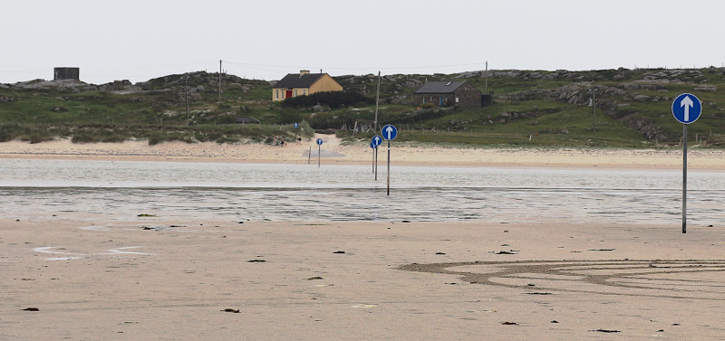

What's a FAODEL?
================

[Faodhail](https://en.wikisource.org/wiki/An_Etymological_Dictionary_of_the_Gaelic_Language/F)
is a Gaelic term for a shallow spot in the water that allows
you to pass from one island to another. If you look at maps of the coastlines
of Ireland and Scottland, you'll find a few places where there are roads in
the water that connect two land masses. These roads are usually right on 
the beach and are only available when the tide is out (follow the arrow
signs). [Faodhail A' Chinn Ear](https://getoutside.ordnancesurvey.co.uk/local/faodhail-a-chinn-ear-beach-na-h-eileanan-an-iar) 
is one example. Omey Strand near Claddaghduff in Ireland (below) is another.
Pro tip: check your rental car agreement and the tide schedule before
driving out on one of these roads.

We liked the idea of our communication software serving as a type of land
bridge that connects two or more independent application islands. The FAODEL
acronym was picked as a simplification of the faodhail terms.

We pronounce it **"fay-oh-dell"**, although that's almost certainly incorrect.

 
